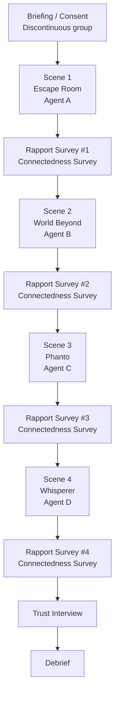
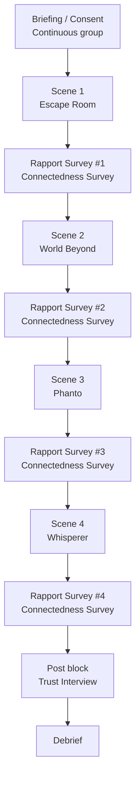

# VR Study: One Soul, Many Forms
# How Identity Contiuity in Multi-Form VR Agents Influences User Credibility, Rapport, and Emotional Connectedness

## Study Overview  
Four open-source VR demos are used, each featuring a different **agent form**.  
Identity continuity is manipulated between subjects.

| VR Demo | Agent Form | Scene Focus |
|---------|------------|-------------|
| **[Escape Room](Experiment/Demos.md)** | Embodied (human) | Puzzle solving |
| **[The World Beyond](Experiment/Demos.md)** | Animal partner | Companion exploration |
| **[Phanto](Experiment/Demos.md)** | Object-based (weapon AI) | MR shooting / cleaning |
| **[Whisperer](Experiment/Demos.md)** | Voice-only | Dialogue-driven puzzle |

### Conditions
| Condition | Identity Treatment | Key Notes |
|-----------|-------------------|-----------|
| **C1 (identity discontinuous)** | Four different names, voices, color themes (A/B/C/D) | Each agent is a unique persona |
| **C2 (identity continuous)** | Same name, voice & signature color across all four demos | Minor cosmetic tweaks only |

---

## Research Question  
> - Does keeping the **same identity** across visually different agents improve users’ **rapport**, **connectedness**, and **credibility** in VR?
> - Does maintaing **identity continuity** in virtual agents with changing apperances help users maintain or **strengthen** their sense of **rapport**, **emotional connectedness** and **credibility** in **VR GAMES**? 
---

## Hypotheses
| ID | Statement |
|----|-----------|
| **H1 (Rapport)** | Continuous identity → higher rapport scores than discontinuous identity. |
| **H2 (Connectedness)** | Continuous identity → higher connectedness scores than discontinuous identity. |

*(Credibility is explored qualitatively; no directional hypothesis tested.)*

---

## Measurements

| Construct | Method | Scale / Source | When collected |
|-----------|--------|----------------|----------------|
| **Rapport** | **Quantitative** | [HARQ (7-point Likert)](Questionnaire/HARQ.md) | **Immediately after each scene** (4 times) |
| **Connectedness** | **Quantitative** | IOS (Inclusion of Other in Self) *or* RISC scale (7-point Likert) | **Immediately after each scene** (4 times) |
| **Credibility** | **Qualitative** | Semi-structured exit interview (audio-recorded) | **Once, after all four scenes** |
| **Manipulation Check** | Single Likert item—“Were the agents the same individual?” | 7-point Likert | After final scene |

---

## Methodology

### 1. Participants  
- **Sample size:**   
- **Recruitment:** 
- **Assignment:** 

### 2. Design  
| Factor | Levels | Type |
|--------|--------|------|
| **Identity Continuity** | Continuous vs. Discontinuous | **Within-subjects** |

> Dependent variables: **Rapport score**, **Emotional Connectedness score** (scene-by-scene).**Credibility** (exit interview).
> Qualitative outcome: **Credibility** (exit interview).

### 3. Apparatus & Materials  
- **Hardware:** 
- **VR demos:**  
  1. *Escape Room* – Embodied agent  
  2. *The World Beyond* – Animal agent  
  3. *Phanto* – Object-based agent (weapon AI)  
  4. *Whisperer* (re-scripted) – Voice-only agent  
- **Identity manipulation:**  
  - *Continuous* group: same name, same voice, same keyfeatures.  
  - *Discontinuous* group: unique names, voices, colors (A/B/C/D) per demo.  
- **Questionnaires:**  
  - **Rapport Scale**  HARQ (7-point Likert)
  - **Connectedness:** 
  - **Manipulation-check:** “These assistants felt like the same person” (1–7 Likert)

### 4. Procedure  
1. **Briefing & Consent** → demographic survey.  
2. Participants experience **all four demos**   
3. **After each demo** → Immediate Likert survey (Rapport + Connectedness).  
4. **Post block:**  
   - Manipulation-check item  
   - **Exit interview** (audio-recorded, 10 min): credibility, moments of high/low trust, impact of identity cues.  
5. **Debrief & compensation**.

### 5. Data Analysis  
- **Quantitative:** 2 (Identity) × 4 (Scene) Paired t-test on Rapport & Connectedness if interaction significant, otherwise using Wilcoxon test.  
  - Post-hoc pairwise (Bonferroni) if interaction significant.  
- **Qualitative:**
- **Manipulation-check:**

## Study Flow — Two Experimental Conditions

### Condition 1 – Identity Discontinuous

### Condition 2 – Identity Continuous

