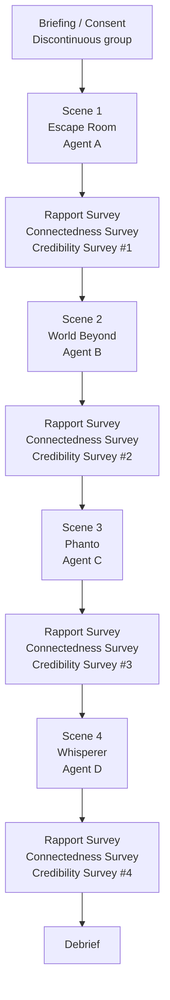
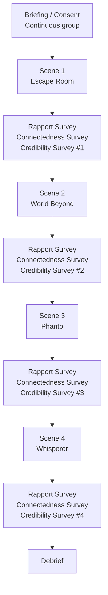

# One Soul, Many Forms(VR Study)
## How Identity Continuity in Multi-Form VR Agents Influences User Credibility, Rapport, and Emotional Connectedness

## Study Overview  
Four open-source VR demos are used, each featuring a different **agent form**.  
Identity continuity is manipulated between subjects.

| VR Demo | Agent Form | Scene Focus |
|---------|------------|-------------|
| **[Escape Room](Experiment/Demos.md)** | Embodied (human) | Puzzle solving |
| **[The World Beyond](Experiment/Demos.md)** | Animal partner | Companion exploration |
| **[Phanto](Experiment/Demos.md)** | Object-based (weapon AI) | MR shooting / cleaning |
| **[Whisperer](Experiment/Demos.md)** | Voice-only | Dialogue-driven puzzle |

### Conditions
| Condition | Identity Treatment | Key Notes |
|-----------|-------------------|-----------|
| **C1 (identity discontinuous)** | Four different names, voices, color themes (A/B/C/D) | Each agent is a unique persona |
| **C2 (identity continuous)** | Same name, voice & signature color across all four demos | Minor cosmetic tweaks only |

---

## Research Question  
> - Does maintaining **identity continuity** in virtual agents with changing appearances help users maintain or **strengthen** their sense of **rapport**, **emotional connectedness** and **credibility** in **VR GAMES**?
---

## Hypotheses
| ID | Statement |
|----|-----------|
| **H1 (Rapport)** | Continuous identity → higher rapport scores than discontinuous identity. |
| **H2 (Connectedness)** | Continuous identity → higher connectedness scores than discontinuous identity. |
| **H3 (Credibility)** | Continuous identity → higher credibility scores than discontinuous identity. |

---

## Measurements

| Construct | Method | Scale / Source | When collected |
|-----------|--------|----------------|----------------|
| **[Rapport](Questionnaire/Definition.md)** | **Quantitative** | [HARQ (7-point Likert)](Questionnaire/HARQ.md) | **Immediately after each scene** (4 times) |
| **[Connectedness](Questionnaire/Definition.md)** | **Quantitative** | [ASAQ(7-point Likert)](Questionnaire/ASAQ.md) | **Immediately after each scene** (4 times) |
| **[Credibility](Questionnaire/Credibility.md)** | **Quantitative+Qualititive** | [Credibility Scale](Questionnaire/Credibility.md) | **Immediately after each scene** (4 times) |
| **Manipulation Check** | “Were the agents the same individual?” | Yes/No | After final scene (Only for C2) |

---

## Methodology

### 1. Participants  
- **Sample size:**   
- **Recruitment:** 
- **Assignment:** 

### 2. Design  
| Factor | Levels | Type |
|--------|--------|------|
| **Identity Continuity** | Continuous vs. Discontinuous | **[Between-subjects](Experiment/Subject_Design.md)** |

> Dependent variables: **Rapport score**, **Emotional Connectedness score**, **Credibility** (scene-by-scene).

### 3. Apparatus & Materials  
- **Hardware:** 
- **VR demos:**  
  1. *Escape Room* – Embodied agent  
  2. *The World Beyond* – Animal agent  
  3. *Phanto* – Object-based agent (weapon AI)  
  4. *Whisperer* (re-scripted) – Voice-only agent  
- **Identity manipulation:**  
  - *Continuous* group: same name, same voice, same keyfeatures.  
  - *Discontinuous* group: unique names, voices, colors (A/B/C/D) per demo.  
- **Questionnaires:**  
  - **Rapport Scale**  [HARQ (7-point Likert)](Questionnaire/HARQ.md)
  - **Connectedness:** [ASAQ(7-point Likert)](Questionnaire/ASAQ.md)
  - **Credibility:**  [Credibility Scale](Questionnaire/Credibility.md)
  - **Manipulation-check:** “Were the agents the same individual?” 

### 4. Procedure  
1. **Briefing & Consent** → demographic survey.  
2. Participants experience **all four demos**   
3. **After each demo** → Immediate Likert survey (Rapport + Connectedness + Credibility).  
4. **Post block:**  
   - Manipulation-check item   
5. **Debrief & compensation**.

### 5. Data Analysis  
- **Quantitative:** UnPaired t-test on Rapport & Connectedness if interaction significant, otherwise using Mann-Whitney test.  
  - Post-hoc pairwise (Bonferroni) if interaction significant.  

## Study Flow — Two Experimental Conditions

### Condition 1 – Identity Discontinuous

### Condition 2 – Identity Continuous

